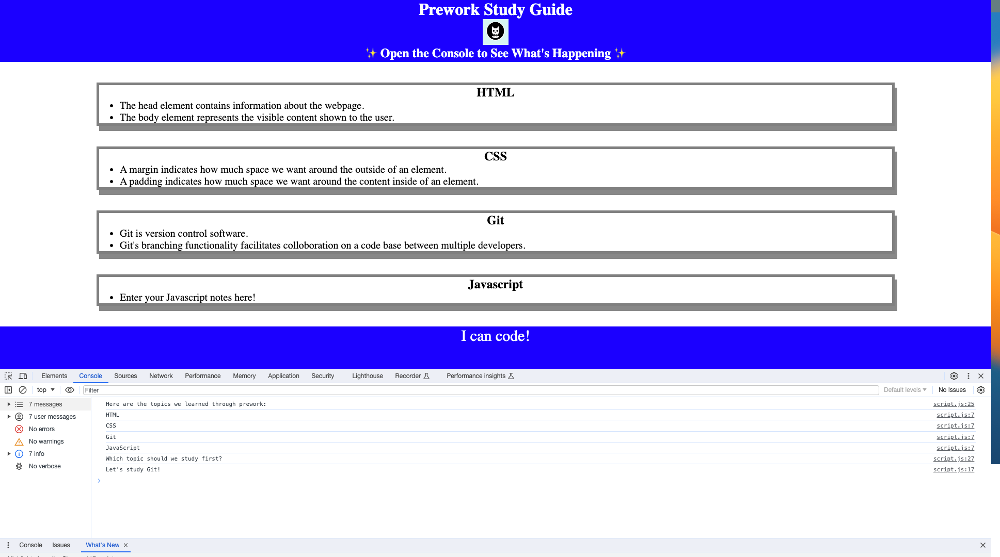

# Prework Study Guide Webpage

## Description

The purpose of this project was to create a study guide for UCF's full-stack bootcamp prework. In the prework we learned essentials of HTML, CSS, Git and JavaScript. The finished study guide should be a repository for notes from the prework that are all in one place and available as a web application.

## Installation

N/A

## Usage

Use this study guide by reviewing the notes in each section. The application can make a suggestion for what to study first, selecting a topic at random. To see this dynamic JavaScript in action open the console in Chrome's DevTools by pressing `Command+Option+I` (MacOS) or `Control+Shift+I` (Windows). There you will see a list of topics studied in prework and a suggestion for what to study first.

Here is a screenshot of the working application:

## Credits

N/A

## License

Please refer to the LICENSE in the repo.